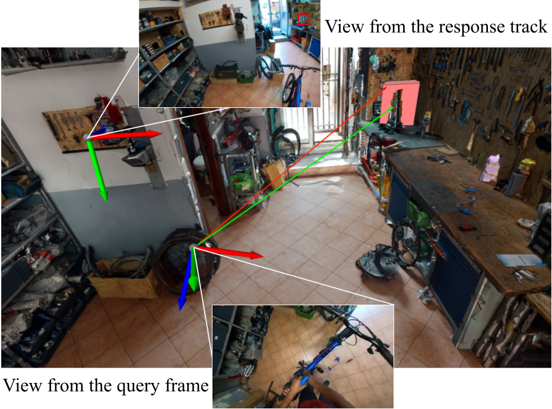

# Visual Queries 3D localization

<p align="center">
    
</p>


## Installation instructions

The code has been tested with Ubuntu > 16.04 and Python 3.7

1. Clone the repositiory from [here](https://github.com/EGO4D/episodic-memory).
    ```
    git clone git@github.com:EGO4D/episodic-memory.git
    cd episodic-memory/VQ3D
    ```
2. Load the git submodules
    ```
    git submodule init
    git submodule update
    ```

3. Create a conda environment.
    ```
    conda create -n ego4d_vq3d python=3.7
    ```

4. Install the requirements using pip:
    ```
    pip install -r requirements.txt
    ```

5. Install COLMAP following these [intructions](https://colmap.github.io/install.html). Don't forget to add the path to colmap into your PATH environment variable.


## Data
1. Download the data using the [client](https://github.com/facebookresearch/Ego4d/blob/main/ego4d/cli/README.md). Place the data into the ./data folder.
    ```
    python -m ego4d.cli.cli --output_directory ~/episodic-memory/VQ3D/data/ --dataset full_scale --universities unict
    python -m ego4d.cli.cli --output_directory ~/episodic-memory/VQ3D/data/ --dataset annotations
    python -m ego4d.cli.cli --output_directory ~/episodic-memory/VQ3D/data/ --dataset 3d
    ```

2. [UPDATE] construct the 5fps clips using the [VQ2D tools](https://github.com/EGO4D/episodic-memory/tree/main/VQ2D). (clips downloaded directly from the client are at 30fps. In the VQ tasks we use 5fps.)
    ```
    python convert_videos_to_clips.py
    ```

2. Generate the `<split>_annot.json` following the instruction under the VQ2D [folder](https://github.com/EGO4D-Consortium/episodic-memory/tree/main/VQ2D) - step 2 from the “Running experiments” section. Place the files under ./data/


## Workflow

### Camera pose estimation
```
cd camera_pose_estimation/
```

1. Compute the camera intrinsics.

* Extract all video frames.
    ```
    python extract_frames_all_clips.py \
        --input_dir data/v1/full_scale/ \
        --output_dir data/v1/videos_frames/ \
        --clips_json data/v1/3d/all_videos_for_vq3d_v1.json \
        --j 8 # number of parallel processes. Increase for spead.
    ```

* Pre-select frames for COLMAP
    ```
    python extract_frames_for_colmap.py \
        --input_dir data/v1/videos_frames/ \
        --output_dir data/v1/videos_frames_for_sfm/ \
        --j 8 # number of parallel processes. Increase for spead.
    ```

* Run COLMAP on the pre-selected frames
    ```
    python get_intrinsics_for_all_clips.py \
        --input_dir data/v1/videos_frames_for_sfm/ \
        --output_dir data/v1/videos_sfm/
    ```

* For videos where sfm fails we run a greedy version of the reconstruction where we select 100 frames in the middle of the video.
    ```
    python get_intrinsics_for_all_clips_greedy.py \
        --input_dir data/v1/videos_frames/ \
        --sfm_input_dir data/v1/videos_frames_for_sfm_greedy/ \
        --output_dir data/v1/videos_sfm_greedy/
    ```

* Get intrinsics for each clips.
    ```
    python get_median_intrinsics.py \
        --input_dir data/v1/videos_sfm/ \
        --input_dir_greedy data/v1/videos_sfm_greedy/ \
        --annotation_dir_greedy data/v1/annotations/ \
        --output_filename data/v1/scan_to_intrinsics.json
    ```

* Note: To help reproducibility camera intrinsics have been added here: `data/scan_to_intrinsics.json`

2. Compute the camera poses

* Extract all clips frames.
    ```
    python extract_frames_all_clips.py \
        --input_dir data/v1/clips/ \
        --output_dir data/v1/clips_frames/ \
        --clips_json data/v1/3d/all_clips_for_vq3d_v1.json \
        --j 8 # number of parallel processes. Increase for spead.
    ```

* Get the camera poses for all frames of all clips
    ```
    python run_all_data.py
        --input_dir data/v1/clips_frames/ \
        --query_filename data/v1/annotations/vq3d_val.json \
        --camera_intrinsics_filename data/v1/scan_to_intrinsics.json \
        --scans_keypoints_dir data/v1/3d/scans_keypoints/ \
        --scans_dir data/v1/3d/scans/ \
        --output_dir data/v1/clips_camera_poses/ \
    ```

* Note-1: Camera pose estimation results on the val set have been included for reference here: `data/all_clips_camera_poses_val.json`
* Note-2: To help reproducibility we are also providing the data for all the intermediate steps to compute the poses for one clip in the val set. You can download that information [here](https://drive.google.com/file/d/1n3dRCrpO0DACfTKwbv3A0YlhFdl6HJm-/view?usp=sharing)

### Depth estimation
```
cd depth_estimation/
```

1. Prepare RGB inputs
    ```
    python prepare_inputs_for_depth_estimation.py \
        --input_dir data/v1/clips_camera_poses/ \
        --vq2d_results data/vq2d_results/siam_rcnn_residual_kys_val.json \
        --vq2d_annot data/v1/annotations/val_annot.json \
        --vq3d_queries data/v1/annotations/vq3d_val.json \
        --vq2d_queries data/v1/annotations/vq_val.json
    ```

2. Compute Depths
    ```
    python compute_depth_for_ego4d.py \
        --input_dir data/v1/clips_camera_poses/
    ```

### VQ3D
```
cd VQ3D/
```

1. Compute Ground-Truth vector in query frame coordinate system for queries with pose estimated.
    ```
    python scripts/prepare_ground_truth_for_queries.py \
        --input_dir data/v1/clips_camera_poses/ \
        --vq3d_queries data/v1/annotations/vq3d_val.json \
        --output_fileaname data/v1/annotations/vq3d_val_wgt.json \
        --vq2d_queries data/v1/vq_val.json
    ```

2. Compute 3D vector predictions
    ```
    python scripts/run.py \
        --input_dir data/v1/clips_camera_poses/ \
        --output_fileaname data/vq3d_results/siam_rcnn_residual_kys_val.json \
        --vq2d_results data/vq2d_results/siam_rcnn_residual_kys_val.json \
        --vq2d_annot data/v1/annotations/val_annot.json \
        --vq2d_queries data/v1/annotations/vq_val.json \
        --vq3d_queries data/v1/annotations/vq3d_val_wgt.json
    ```

3. Run evaluation
    ```
    python scripts/eval.py \
        --vq3d_results data/vq3d_results/siam_rcnn_residual_kys_val.json

    ```

* Note: To help reproducibility we provide the results for the val set here: `data/vq3d_results/siam_rcnn_residual_kys_val.json`


## [UPDATES] Notes about the Challenge

1. Please use the `vq3d_test_unannotated_template.json` file (under **data/**) for the challenge.
   These queries are the same as the ones downloaded using the ego4d-client, we have added the 'annotation_uid' entry to help match VQ3D and VQ2D queries.

2. To find the corresponding VQ2D queries you should use the 'annotation_uid' entry found in each VQ3D query.
   We have also added a `mapping_vq2d_to_vq3d_queries_annotations_test.json` to help find the corresponding queries.
   Please refer to [these lines](https://github.com/EGO4D/episodic-memory/blob/2118006b2c7a182ff93416cc876bc4623192a4c9/VQ3D/VQ3D/scripts/run.py#L171) to understand how to use it.

3. To create a submission for the challenge you should use the `vq3d_test_unannotated_template.json` file and add the required information directly in it.


[1]: https://arxiv.org/abs/2110.07058
[2]: https://ego4d-data.org/
